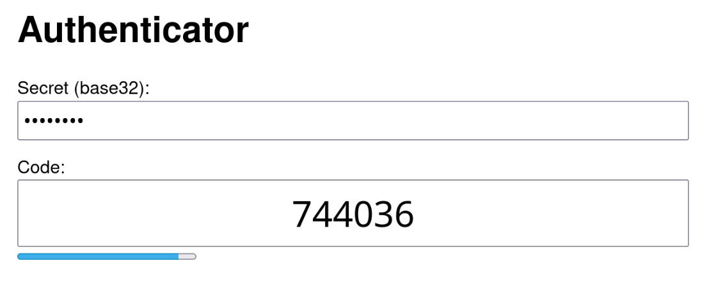

totp
====
From-scratch, dependency-free implementation of
[TOTP](https://en.wikipedia.org/wiki/Time-based_one-time_password),
including SHA1, for education. TOTP is the most common standard for
generating codes in 'Authenticator' apps.

Live web version: https://sjmulder.nl/totp/

Details
-------
Sources:
 - `totp.{c,h}` - the algorithms.
 - `std.{c,h}` - some libc functions for freestanding targets (WASM,
   GBA).
 - `main.c` - a simple CLI.
 - `test.c` - unit tests.
 - `index.html` - a frondend for the WASM build.

Targets:
 - `totp` - the CLI.
 - `totp{32,64}.exe` - the CLI, for Windows.
 - `totp.wasm` - a WebAssembly build, used by `index.html`.

TOTP generators take a seed (the "shared secret"), which is usually
presented as a QR code or base32-encoded string when setting up the
authenticator.

This implementation generates codes for the current time given a seed,
but the CLI nor the WASM web version store seeds for later use.

Building
--------
 - `make` to  build CLI using default C compiler.
 - `make check` to run tests.
 - `make cross` to  build Windows and WASM targets.

For Windows and WASM, default compilers and flags are specified in
the Makefile but can be overridden with make flags or `config.mk`,
which is automatically included if it exists.

Author
------
Sijmen Mulder (ik@sjmulder.nl). See LICENSE.md.
